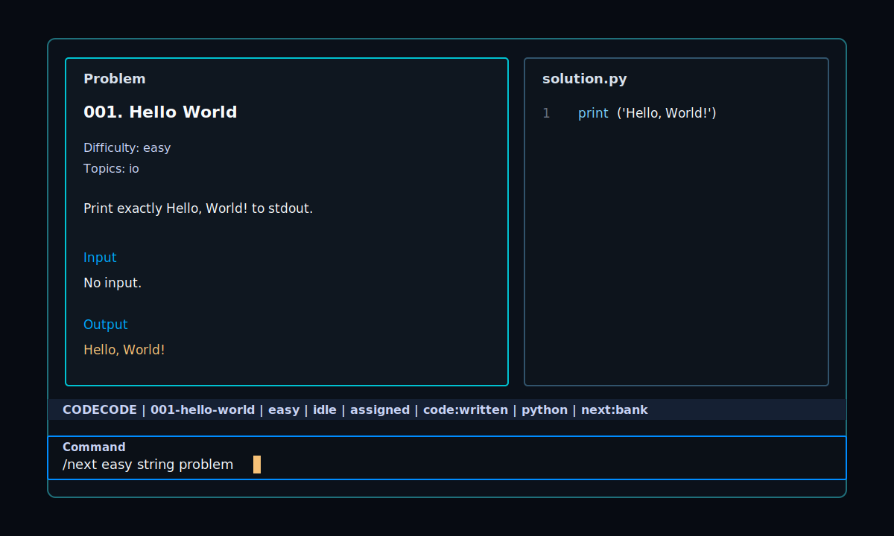

# codecode




Coding-test reps, right in your terminal.

`codecode` is a small Rust TUI for stdin/stdout practice: problem on the left, code on the right, judge loop in the same terminal.
No browser tab shuffle, no paste dance, just solve and run.

## Why It Exists

- Fast local judging for Python, TypeScript, Java, and Rust
- Gradual problem flow with local history
- Codex-powered `/next <request>` when you want a custom problem
- Personal problem-generation notes
- Small stack: Rust, Ratatui, Crossterm, and plain process execution

## Quick Start

```bash
git clone https://github.com/baba9811/codecode.git
cd codecode
cargo run --
```

Want a local binary?

```bash
cargo install --path .
codecode
```

## Daily Loop

The code editor starts focused.

```text
write code
Esc, then /run
Esc, then /next easy string problem
```

Submissions are saved as you type under `submissions/<problem-id>/solution.<ext>`.

## Commands

Press `Esc`, then `/`, to focus the command bar.

| Command | Action |
| --- | --- |
| `/run` | Judge the current submission |
| `/next` | Open the next local problem, or ask Codex to create one |
| `/next easy string problem` | Ask Codex for a custom next problem |
| `/prev` | Go back through problem history |
| `/list` | Browse problems with `up/down` or `j/k`, open with `Enter` |
| `/open 2` | Open by number, id, or slug |
| `/giveup` | Show the reference answer |
| `/codex hint` | Ask Codex about the current problem and submission |
| `/lang python` | Set language: `python`, `ts`, `java`, `rust` |
| `/ui ko` | Set UI language: `ko`, `en` |
| `/theme` | Toggle dark/light theme |
| `/source codex` | Prefer Codex for next-problem generation |
| `/exit` | Quit |

The editor owns normal typing keys.
Press `Esc`, then `/`, when you want the command bar.

## Custom Problem Generation

`/next <request>` passes your request into the Codex problem generator. Examples:

```text
/next a slightly harder string problem
/next hashmap practice, easy
/next sorting problem, no graph yet
```

Codex reads [docs/problem-authoring-notes.md](docs/problem-authoring-notes.md) every time it creates a problem. Add personal preferences in `.codecode/problem_notes.md` when you want a standing note that stays local:

```text
Prefer concise statements.
I want more string and hashmap practice.
Avoid DP until I ask for it.
```

Generated problem banks stay local:

| Path | Purpose |
| --- | --- |
| `.codecode/problem_bank.json` | Local/custom/generated problem bank |
| `.codecode/problem_notes.md` | Optional personal problem-generation notes |
| `.codex/problem-state.json` | Current problem, history, settings |
| `problems/` | Generated problem markdown/index files |
| `submissions/` | Your answer files |

Those paths are ignored by git, so your practice history stays yours.

## Debug Prints

`/run` shows raw stdout when a case fails. If you want debug output without changing the judged answer, print to stderr:

```python
import sys

print("debug", value, file=sys.stderr)
```

## Development

```bash
cargo test
cargo run -- --smoke
cargo run --
```

Small on purpose: Ratatui for drawing, Crossterm for terminal events, and direct compiler/runtime calls for judging.

## Discovery Notes

Recommended GitHub topics for this repo:
`coding-practice`, `competitive-programming`, `algorithms`, `ratatui`, `tui`, `rust`, `codex`, `local-first`.

## References

- Ratatui terminal UI library: https://ratatui.rs/
- Crossterm terminal backend/events: https://github.com/crossterm-rs/crossterm
- Codex CLI open-source repo: https://github.com/openai/codex
- Kattis problem package format: https://www.kattis.com/problem-package-format/
- ICPC judging guidelines: https://icpc.global/regionals/regional-contest-cookbook-judging-guidelines
- GitHub README image guidance: https://docs.github.com/repositories/managing-your-repositorys-settings-and-features/customizing-your-repository/about-readmes
- GitHub repository topics: https://docs.github.com/articles/classifying-your-repository-with-topics
