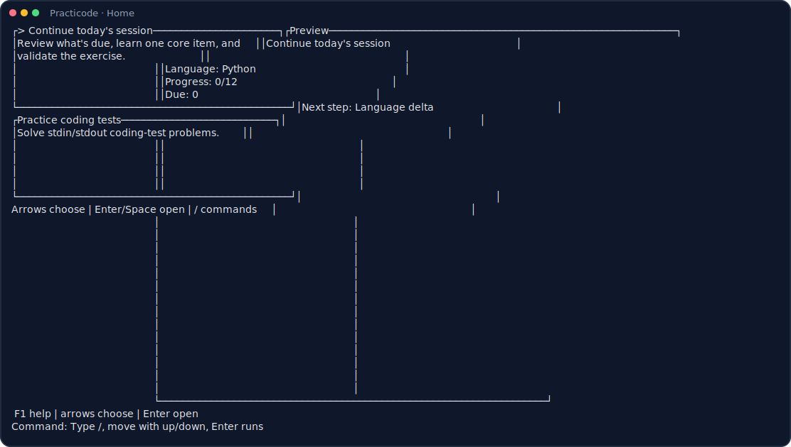
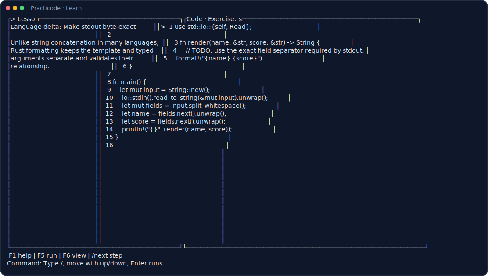

# Practicode

[](https://github.com/baba9811/practicode/actions/workflows/ci.yml)
[](https://crates.io/crates/practicode)
[](https://www.npmjs.com/package/practicode)
[](https://www.npmjs.com/package/practicode)
[](https://github.com/baba9811/practicode/stargazers)
[](LICENSE)

Learn a programming language in 15 focused minutes a day—without leaving your terminal.

Practicode is an offline-first Rust TUI for developers moving between Python, TypeScript, Java, and Rust. It combines short, executable lessons, delayed review, a real local compiler/judge, and optional AI help. No account, streak, or telemetry is required.

<figure>
  
  <figcaption>Actual TUI render: choose a guided learning session or open-ended coding-test practice.</figcaption>
</figure>

<figure>
  
  <figcaption>Actual TUI render: read, predict, edit, run, and reflect in one responsive terminal.</figcaption>
</figure>

## Start In One Minute

```bash
npm install -g practicode
practicode
```

The npm launcher downloads the matching prebuilt binary, verifies its SHA-256 checksum, and caches it in your user directory. Rust is not needed for the npm install path.

Then choose **Continue today's session** and press `Enter`. Core lessons and progress work locally; network access is only needed for the first binary download, update checks, and AI features you explicitly invoke.

## Why Practicode

- **A real daily loop:** up to two due reviews, one new core lesson, one prediction, one executable exercise, and one transfer prompt.
- **Trustworthy practice:** the curriculum CI compiles or runs 110 exercises against 337 deterministic cases and 54 semantic mutants.
- **Actual language differences:** lessons explain runtime versus type checker, ownership versus borrowing, value versus identity, imports versus visibility, and other transfer traps.
- **Mastery that waits:** successful core work moves through Practiced, Retained, and Mastered on a 1/3/7-day review schedule.
- **Fully local fundamentals:** without invoking optional AI, progress, source code, submissions, lessons, and judging stay on your machine.
- **Responsive terminal UX:** side-by-side panes on wide terminals, focused Lesson/Code/Result views on narrow terminals, keyboard and mouse support, dark and light themes.
- **Five-language curriculum and core loop:** every lesson and the main learning flow are localized in English, Korean, Japanese, Simplified Chinese, and Spanish.
- **Optional AI, limited authority:** Codex or Claude can explain and hint, but only deterministic judge results advance mastery.

## The 15-Minute Session

| Step | What you do | What Practicode records |
| --- | --- | --- |
| Review | Recall the objective of up to two due lessons | Due order; attempts begin when the review exercise is judged |
| Language delta | Compare this language with ones you already know | Nothing yet—reading is not mastery |
| Predict | Pause and decide what the example or edge case will do | Nothing—this is a deliberate recall step |
| Exercise | Edit the starter and run real local cases | Pass/failure kind and attempt count |
| Reflect | Read the transfer trap after a passing run | Next 1/3/7-day review |

`/progress` shows a privacy-safe summary with no paths or submitted code. Labs remain optional; the 12-item core path in each language determines course completion.

## Curriculum

| Language | Core path | Optional labs | Total |
| --- | ---: | ---: | ---: |
| Python 3.12 | 12 | 13 | 25 |
| TypeScript 5.9 / Node 22 | 12 | 16 | 28 |
| Java 21 | 12 | 16 | 28 |
| Rust 2024 | 12 | 17 | 29 |

The courses are designed for experienced developers switching languages, not for memorizing isolated syntax. Every record includes a concept, worked example, common mistakes, self-checks, observable objective, language delta, prediction prompt, exercise, and transfer trap.

## Controls

Press `/` outside the editor to open the command palette. The most useful controls are:

| Key or command | Action |
| --- | --- |
| `F1` | Open contextual help |
| `F5` or `/run` | Compile/run and judge the current exercise |
| `F6` | Cycle Lesson/Code/Result in Learn or Problem/Code in Practice |
| `/next` | Advance the guided step or open the next item |
| `/lesson` | Open the complete lesson reference |
| `/progress` | Show the shareable mastery summary |
| `/ask <question>` | Ask optional AI about the current learning context |
| `/doctor` | Check the installed language runtimes |
| `/home` | Return to the Learn/Practice chooser |

See [the command reference](docs/COMMANDS.md) for practice mode, aliases, generation, and profile settings.

## Language Runtimes

The Practicode binary is prebuilt, but local judging needs the runtime for the language you exercise:

- Python: Python 3.12
- TypeScript: Node.js 22 and `tsc` 5.9.3
- Java: JDK 21 (`javac` and `java`)
- Rust: stable Rust with the 2024 edition

Install only what you plan to study, then run `/doctor` inside Practicode.

<details>
<summary>macOS</summary>

```bash
brew install python@3.12 node@22
npm install -g typescript@5.9.3
brew install --cask temurin@21
curl --proto '=https' --tlsv1.2 -sSf https://sh.rustup.rs | sh
```

</details>

<details>
<summary>Windows</summary>

```powershell
winget install -e --id Python.Python.3.12
winget install -e --id OpenJS.NodeJS.LTS
npm install -g typescript@5.9.3
winget install -e --id EclipseAdoptium.Temurin.21.JDK
winget install -e --id Rustlang.Rustup
```

Restart the terminal after installation.

</details>

<details>
<summary>Ubuntu / Debian</summary>

Use your distribution packages or the vendors' repositories for Python 3.12, Node 22, and JDK 21, then install the pinned TypeScript checker and Rust:

```bash
npm install -g typescript@5.9.3
curl --proto '=https' --tlsv1.2 -sSf https://sh.rustup.rs | sh
```

Official installers: [Python](https://docs.python.org/3/using/), [Node.js](https://nodejs.org/en/download), [Temurin](https://adoptium.net/installation/), and [Rust](https://www.rust-lang.org/tools/install).

</details>

Verify the toolchain:

```bash
python3 --version
node --version
tsc --version
javac -version
rustc --version
```

## Docker Sandbox

To get all four supported language toolchains and keep submissions out of normal host processes:

```bash
practicode --docker
```

The npm launcher builds a local image with Python 3.12, Node 22, TypeScript 5.9.3, JDK 21, and stable Rust. It runs without network access, drops Linux capabilities, uses a read-only root filesystem, limits CPU/memory/processes, mounts the current workspace read-only, and gives the container write access only to the Practicode data directory.

Docker is shared-kernel isolation, not a guarantee against every container escape. Check the image with:

```bash
practicode --docker --smoke
```

## Other Install Paths

<details>
<summary>Cargo</summary>

```bash
cargo install practicode
practicode
```

</details>

<details>
<summary>Source checkout</summary>

```bash
git clone https://github.com/baba9811/practicode.git
cd practicode
cargo run --
```

</details>

Prebuilt npm binaries support macOS Intel/Apple Silicon, Linux x64/arm64, and Windows x64. On another target, use Cargo or Docker.

## Binary Cache And Offline Use

Every native npm launch revalidates the cached binary against its stored SHA-256 checksum. A failed or partial download is removed before execution.

| Platform | Default cache root |
| --- | --- |
| macOS | `~/Library/Caches/practicode/` |
| Linux | `$XDG_CACHE_HOME/practicode/` or `~/.cache/practicode/` |
| Windows | `%LOCALAPPDATA%\practicode\` |

Set `PRACTICODE_CACHE_DIR` to choose another cache. Once a version has been verified, it can launch offline from that version-and-platform-specific cache.

Update npm installs with:

```bash
npm update -g practicode
```

Practicode checks npm for newer versions in the background. Disable that check with `PRACTICODE_NO_UPDATE_CHECK=1`.

## Local Data And Privacy

User data lives under `~/.practicode` by default (`%USERPROFILE%\.practicode` on Windows):

| Path | Purpose |
| --- | --- |
| `problem-state.json` | Settings, history, and learning mastery |
| `problem_bank.json` | Local, custom, and generated problems |
| `problem_notes.md` | Optional generation preferences |
| `problems/` | Generated problem statements and indexes |
| `submissions/` | Your source files |

Set `PRACTICODE_HOME=/another/path` to relocate all user data.

`/run` executes local source as a normal child process unless Docker mode is active. When invoked, `/ask` and `/hint` send the current problem or lesson, submission code, latest result, and your question to the selected provider CLI. AI-backed `/next` and `/generate` run that CLI from `PRACTICODE_HOME`; they may read the local state, bank, notes, problem index, and submissions and may create or update generated problem files under the CLI's configured `workspace-write`/`acceptEdits` permissions. Custom `ai_next_command` programs inherit the access you give them. Review your provider and custom-command settings before enabling AI. Environment variables are scrubbed before judging, and hidden expected values are not printed in failure logs. See [SECURITY.md](SECURITY.md).

## Practice Mode

The second home option keeps classic stdin/stdout coding-test work beside the guided curriculum. It includes a local problem bank, gradual difficulty, exact-output judging, problem history, and optional AI generation. Learn mode and Practice mode share the editor and judge but keep their progress rules separate.

## Contributing

The fastest contributions are a precise lesson correction, a reproducible terminal bug, or a focused accessibility improvement.

- [Contribution guide](docs/CONTRIBUTING.md)
- [Lesson catalog contract](assets/lessons/README.md)
- [Architecture](docs/ARCHITECTURE.md)
- [Maintainer and release guide](docs/MAINTAINING.md)
- [Privacy-safe growth plan](docs/GROWTH.md)

Run the full local gate with `make test`. Changed lesson content additionally requires executable cases, a refreshed content hash, and an independent agent review recorded in the lesson review manifest; a human reviewer is not required.

## License

Practicode is MIT licensed. Third-party dependency notices are in [THIRD_PARTY_LICENSES.md](THIRD_PARTY_LICENSES.md).
